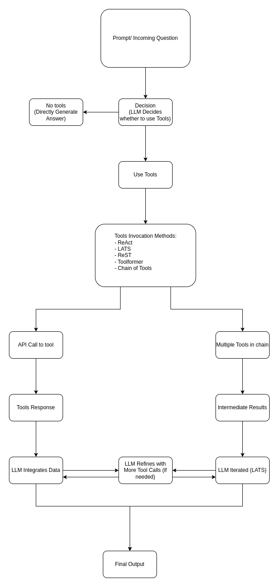

## Description of the diagram
The Drawio Diagram depicts, how the large language models or LLM's decide whether to use the external tool or not and how tools can be used if needed. It starts with prompt input, and the LLM decides whether to directly generate the answer or to use the tool. If tools are needed, the LLM chooses from many possible APIs in which techniques like ReAct, LATS, ToolFormer, and chain of tools are used. The model then communicates with the tools/API or tool chains, processes the tool's response, iterates as needed before integrating the data to produce the final output, and learns from the output using ReST.

<p align="center">
  
</p>


# Conceptual Analysis

## Introduction:
Large Language Models (LLMs) have moved beyond static text production in recent years, including external tools to improve reasoning, decision-making, and real-world applicability. Several systems have arisen, including ReAct, LATS, ReST, Toolformer, and Chain-of-Tools, each with its own methodology for integrating external knowledge and computational resources. These methods differ in how they structure reasoning steps, use tools, and maximise efficiency. This analysis investigates and contrasts different approaches, highlighting their strengths, limits, and applicability to real-world applications. By studying agent design, reasoning mechanisms, and tool interaction techniques, we can gain a deeper understanding of the trade-offs between adaptability, accuracy, and computing efficiency in tool-augmented LLMs.
Answering complex natural language queries usually needs several steps of reasoning and the incorporation of other data. To overcome these difficulties, several systems combine knowledge retrieval with a large language model (LLM). These systems, however, have a wide range of failure possibilities, and we cannot deliberately train them from start to finish to remedy such errors since interaction with external knowledge is non-differentiable. In this Analysis Report, we compare agent design, reasoning procedures, and tool usage. Summarised each strategy, compared approaches, and evaluated real-world applicability.

## Comparison of Agent Design

The design of an LLM-based agent has a considerable impact on its capacity to interact with external tools.
- ReAct (Reasoning + Acting) in this action is merged with Reasoning and taking inputs for each response from the tools like web search output (Wikipedia search output). This improves the ability of the Agent to find the correct result but it takes multiple iteration, it decreases the chances of hallucination which in comparison to COT was 0% for ReAct and 56%  for COT on HotpotQA.
- Language Agent Tree Search (LATS) is a framework for enhancing Large Language Models (LLMs) that combines thinking, acting, and planning with Monte Carlo Tree Search (MCTS). It aims to improve decision-making, tool use, and complex problem-solving by allowing models to investigate alternate reasoning paths, learn from external feedback, and self-reflect.
- ReST (Reinforced Self-Training) is a technique for self-improvement in multi-step reasoning LLM agents. The method is based on ReAct, which interleaves reasoning and actions for multi-step tasks, iteratively improving the agent with AI feedback rather than human annotations.
- Toolformer determines when and how to call tools, giving it a more autonomous but less interpretable system.
- Chain-of-Tools generates pipelines of several tool interactions, allowing LLMs to accomplish sophisticated multi-step tasks. However, handling dependencies across tools might complicate the execution flow.

## Comparison of Reasoning Steps
The reasoning strategies used by these methodologies influence how well they guide tool use and problem resolution.
- ReAct merges reasoning and action, allowing LLM to reason every next step before engaging with tools again to fetch the required result.  This promotes adaptability, but can lead to redundant loops, when reasoning processes are repeated unnecessarily.
- LATS Language Agent Tree Search improves reasoning by focusing on planning before taking any action. LATS is the first general framework that synergizes the capabilities of LMs in reasoning, acting, and planning.  Defining task templates removes redundant reasoning stages and improves productivity.
- ReST (Reinforced Self-Training) refines reasoning through iterative reinforcement, leveraging previous successes and failures to better future tool use.  This increases adaptability but necessitates a large amount of training data.
- ReST (Reinforced Self-Training) improves reasoning through iterative self-reinforcement and continuous training and improves the model by using the tool response and comparing previous successes and failures to train the model instead of relying on human-annotated data.
- Toolformer enables the model to determine tool use on its own, incorporating tool invocation into the language model's training.  While this lowers manual oversight, the reasoning phases are not formally structured, which complicates debugging.
- Chain-of-Tools divides complex processes into sequential or parallel steps, necessitating reasoning to manage dependencies and intermediate outcomes across several tools.  This hierarchical technique provides logical development while increasing execution complexity.

## Assessment of Real-World Applicability
Adaptability, efficiency, interpretability, and robustness in managing a variety of activities are some of the elements that determine how well these methods work in practical applications.
- ReAct works effectively in dynamic settings as reasoning combined with action is a good strategy for fetching data from the web. It gives LLM's ability to reason before taking the next step while considering the tool's response in real-time. It is an efficient process but it can get stuck in a loop if not supervised or improved according to the previous output. 
- LATS is excellent at organised task execution, it can be used for knowledge retrieval and business process automation activities where productivity is increased by following preset processes. Its rigidity, however, might hinder performance on open-ended jobs that call for original problem-solving techniques.
- The main idea behind ReST (Reinforced Self-Training), which builds on ReAct, is for the model to learn from past decisions. This will be very helpful for personalised recommendation since it allows LLMs to learn and suggest new products to users based on past decisions.
- When it comes to collecting and processing data for websites that require web crawling and specified outputs, Toolformer and Chain of Tools are extremely effective techniques that allow the LLMs to choose which tool to employ.

## Conclusion of Analysis
In terms of logic, tool usage, and overall agent design, each paradigm offers unique advantages and disadvantages. While LATS and ReST offer structured optimisation, ReST uses reinforcement for continual improvement, while ReAct is more flexible but prone to inefficiencies. Toolformer prioritises automation above interpretability by integrating tool choices at the model level. Complex operations are made possible by Chain-of-Tools, but careful coordination is needed. The needs of the application—whether they emphasise efficiency, flexibility, or organised execution—determine the approach to be used. As LLM research develops, hybrid techniques that combine these tactics might appear, improving tool integration and reasoning for more extensive real-world use cases.


## Annotated Logs
```base
Hello, I am your Virtual shopping assistant. I can help you out with the following:
 1. Price of the available product 
 2. Available discount
 3. Shipping timing
 4. Compare prices with competitors
 5. Return Policy

I can tell you about the following available products:
Shoes,  Shirt,  Belt, Socks,  Dress,  and Blouse

Please let me know how can I help?
INPUT->Find me a Good pair of shoes with some good discount, compare prices, and let me know the return policy if possible.
🛍️ Here’s what I found for you:

✨ Running Shoes - $80 (Size: 9)
✨ Casual Sneakers - $50 (Size: 10)
🎉 Discount available: 10% off!
💰 Competitor price: $9 at TrendMart
🔄 Return policy: No return on discounted items

```
In the above Logs you can see that using the virtual shopping assistant is very self explanatory, it has fixed functions that it can perform that are listed on the top along with that it has very limited number of available products since it a Mock and we are not pulling data form webpage we have added simulated data for the mock. 
The user can ask virtual assistant for multiple things at once and if the data is available in the Database, the Agent will help you find the best deal.


## Design Decisions
Agent Architecture & Reasoning

- We chose a ReAct-inspired reasoning framework to enable structured decision-making before tool use.

- This helps the agent evaluate when and which tools to invoke, reducing unnecessary calls.

Tool Invocation & Integration

- Implemented structured function calls instead of free-text parsing to ensure reliability.

- Allows for easy expansion by adding new mock tool APIs.

Multi-Step Query Handling

- The agent processes multiple user constraints (e.g., price, discount, shipping) and calls tools accordingly.

- Uses a step-by-step breakdown to handle complex queries seamlessly.

Error Handling & Fallbacks

- Added basic error handling to prevent failures if a tool returns an invalid response.

- Example: If search_products() fails, the agent suggests similar alternatives.

## Challenges & Improvements 

🔹 1. Scalability Issues
- Challenge:
  - Current implementation is mock-based (limited set of tools & data).
  - Real-world integration would require handling large datasets and real API calls.
- Future Improvement:
  - Implement real API connections for e-commerce platforms.
  - Optimize tool selection strategy for better efficiency.


🔹 2. Tool Invocation & Response Handling
- Challenge:
  - Ensuring the agent correctly interprets user queries and picks the right tools.
  - Some tools may return unexpected or incomplete results (e.g., missing discount details).
- Future Improvement:
  - Use fallback mechanisms (if one tool fails, try an alternative approach).
  - Improve error detection in tool outputs (e.g., flagging missing values).
  
🔹 3. Handling Multi-Step Reasoning & Dependencies
- Challenge:
  - Some queries require multiple tools (e.g., searching for an item, applying a discount, checking shipping).
  - Ensuring the correct order of tool execution is difficult.
- Future Improvement:
  - Implement state tracking so the agent remembers previous tool outputs.
  - Experiment with Tree Search (LATS-based planning) for better decision-making.

🔹 4. Error Handling & Agent Self-Correction
- Challenge:
  - If a tool provides incorrect or no response, the agent currently does not retry or adjust its reasoning.
  - Some discount codes may be invalid, but the agent still applies them.
- Future Improvement:
  - Implement self-correction by re-evaluating failed tool outputs.
  - Train the agent to ask follow-up questions if information is missing.
  
🔹 5. Adaptability to Unseen Queries
- Challenge:
  - The agent is designed for specific e-commerce queries (e.g., price, discount, shipping).
  - If a user asks an out-of-scope question, it may not respond effectively.
- Future Improvement:
  - Use few-shot prompting to generalize better to new queries.
  - Integrate LLM fine-tuning on more diverse shopping-related prompts.
